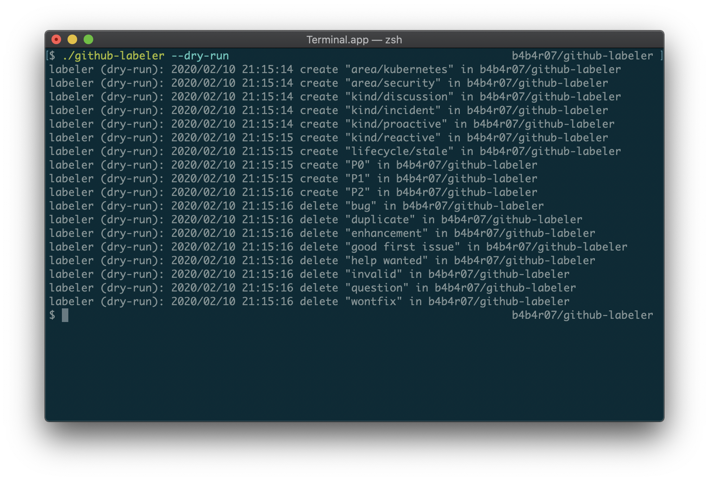
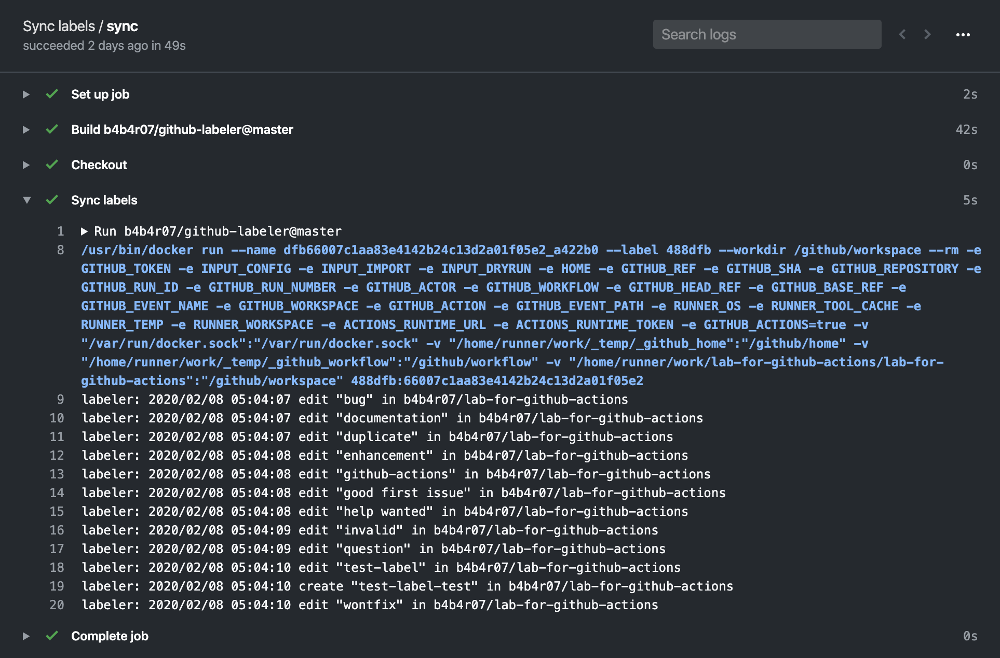

Labels as a Code!
=================



CLI that sets GitHub labels exactly as written in YAML file

## Concepts

- Create a label (e.g. when no label described in YAML)
- Edit a label (e.g. when its color was changed)
- Delete a label (e.g. when the label not described in YAML exists on GitHub)

## YAML example

```yaml
labels:
  - name: kind/proactive
    description: Categorizes issue or PR as related to proactive tasks.
    color: 9CCC65
  - name: kind/reactive
    description: Categorizes issue or PR as related to reactive tasks.
    color: FFA000

repos:
  - name: org/repo
    labels:
      - kind/proactive
      - kind/reactive
```

## Run as GitHub Actions

### YAML for defined labels

You can put this file to anywhere as you like. It defaults to `.github/labels.yml`. This is the config file to define the labels. Basically it means GitHub labels are configured as this file defines.

<details><summary><code>.github/labels.yml</code></summary>
</br>

```yaml
labels:
- name: help wanted
  description: Extra attention is needed
  color: "008672"
- name: bug
  description: Something isn't working
  color: fc2929
- name: enhancement
  description: New feature or request
  color: 84b6eb
- name: question
  description: Further information is requested
  color: cc317c
repos:
- name: user/repo
  labels:
  - help wanted
  - bug
  - enhancement
  - question
```

</details>

### YAML for workflows to sync labels between existing one and defined one

This is the one of the workflow of this app.
It means to do the same with GitHub Actions as running github-labeler on your local machine.

<details><summary><code>.github/workflows/sync_labels.yml</code></summary>
</br>



```yaml
name: Sync labels

on:
  push:
    branches:
      - master
    paths:
      - .github/labels.yml

jobs:
  sync:
    runs-on: ubuntu-latest
    steps:
      - name: Checkout
        uses: actions/checkout@1.0.0
      - name: Sync labels
        uses: b4b4r07/github-labeler@master
        env:
          GITHUB_TOKEN: ${{ secrets.GITHUB_TOKEN }}
```

</details>

### YAML for workflows to import labels from existing one to defined one

This is the workflow to import your existing labels on GitHu to the definition YAML.
Even if you define the labels on YAML file, someone may change the label information or create new one on GitHub (Web UI). If so, these labels updating should be synced with the definition file. In order to solve those problems, this workflow imports label-related changes triggered by events of labels activities.

<details><summary><code>.github/workflows/import_labels.yml</code></summary>
</br>

```yaml
name: Import labels

on:
  label:
    types:
      - created
      - edited
      - deleted

jobs:
  sync:
    runs-on: ubuntu-latest
    steps:
      - name: Checkout
        uses: actions/checkout@1.0.0
      - name: Import between existing labels
        uses: b4b4r07/github-labeler@master
        with:
          import: 'true'
        env:
          GITHUB_TOKEN: ${{ secrets.GITHUB_TOKEN }}
      - name: Create Pull Request
        uses: peter-evans/create-pull-request@v1
        with:
          token: ${{ secrets.GITHUB_TOKEN }}
          commit-message: "Import existing labels"
          title: "Import existing labels"
          body: |
            ## WHAT
            This pull request was created by [create-pull-request](https://github.com/peter-evans/create-pull-request).
            ## WHY
            Current labels.yaml and existing labels don't match.
          branch: import-labels
          branch-suffix: timestamp
```

</details>


## Installation

Download the binary from [GitHub Releases][release] and drop it in your `$PATH`.

- [Darwin / Mac][release]
- [Linux][release]

## License

[MIT][license]

[release]: https://github.com/b4b4r07/github-labeler/releases/latest
[license]: https://b4b4r07.mit-license.org
